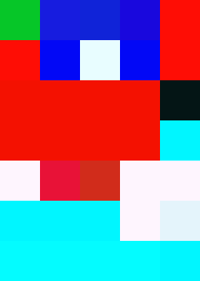
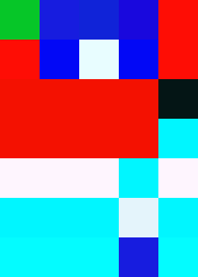
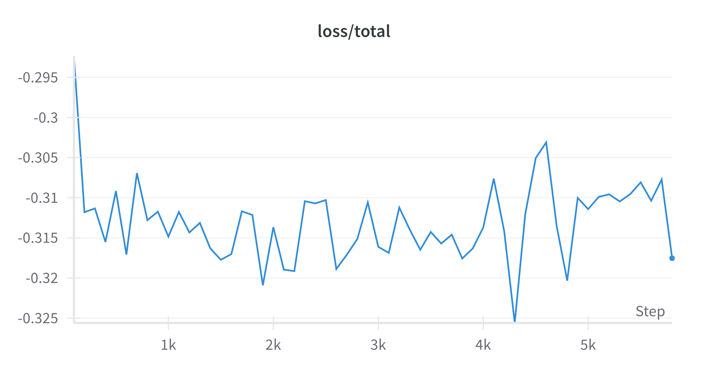
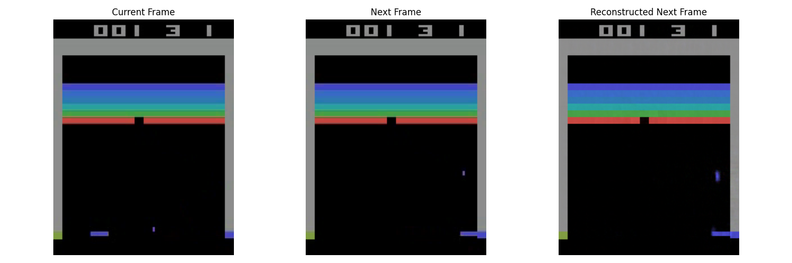
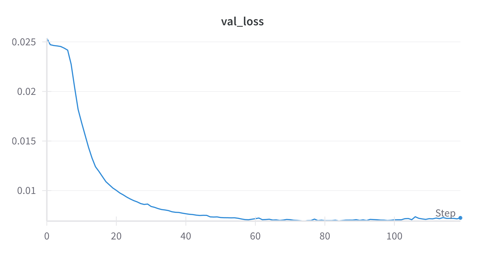
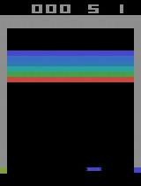

# Experiment: Manipulating the Latent Space of a World Model to Change Game Physics

I wanted to explore the latent space and the things one can achieve without further training. I explored the latent space to achieve two things: 1) increase the ball speed and 2) change the bricks design with time.

Why this experiment is cool and important at the same time? If this is possible it means we can completely interpret the latent space and programmatically manipulate it according to our requirement without further or with minimal training. I conducted this experiment to tweak the game physics using latent manipulation or minimal fine tuning. 

### Visualise the the latent space and visually differentiate between latent spaces of faster and slower ball speed.

I generated gameplay videos of the game "Breakout" with different ball speeds using a Random agent. The videos were then passed through the world model to obtain the latent representations. Upon visualizing the latent space, I observed that the latent representations of the faster ball speed gameplay were distinct from those of the slower ball speed gameplay. This suggests that the world model captures the dynamics of the game, including the speed of the ball, in its latent space.

<div style="text-align: center;">
  
  
</div>

To generate the above gifs, run:
```bash
python3 get_velocity.py    
```

Since the ball passes faster through certain areas, I noticed that certain region in the latent space has more frequent updates compared to others. This indicates that the world model is sensitive to the speed of the ball and can differentiate between faster and slower gameplay. The question is how to find out the exact latent vector that represents the ball speed and how to manipulate it to achieve faster ball movement in the game.


Methods to increase the ball speed:
- Latent interpolation 
  Compute and store the latent representations of both the faster and slower gameplay.  Compute the average difference between them to identify the latent vector that represents the velocity of the ball. Add this velocity vector to any latent vector to reconstruct frames with faster ball speed. 

  Either consider manipulating the entire latent or only the visually identified area representing the ball movement. 

  I tried both methods and found that none of the methods could actually increase the ball speed in a visually noticeable way. In fact, the ball direction was changed to something random. 

- Fine tuning
  Since, I was not able to isolate the velocity vector, I decided to fine tune the world model with a new dataset containing faster ball speed. For this fine tuning, I added new entires to the codebook but nullified the gradients to the older entires in the codebook. This way, I was able to preserve the old latent space while adding new entries that would represent the ball speed upon training. I did train and achieve the following loss graph:

  

  The following code was used to fine tune the world model:
  ```bash
  python3 finetune_for_speed.py
  ```

  Upon closer look, I noticed that the training dataset was in RGB while the order used to train the world model was BGR. Therefore, I didn't actually generate using this new world model. Shortly after this, I realized a better way to doing this i.e to train the (state, action) mlp to latent with the new dataset. Firstly, I confirmed if the existing world model could reconstruct the frames with faster ball speed.

### checking whether the world model can reconstruct frames with faster ball movement.  



This plot clearly shows that the world model could reconstruct the next frame even if the ball speed is faster. This means that the world model is capable of understanding the dynamics of the game, including the speed of the ball.

### Training the (state, action, speed_idx) mlp to latent with the new dataset
I added a few extra dimensions to the input of the mlp to include the speed index. The speed_index is passed as an one hot encoding with the following index values representing:

```python
SPEED_INDEX = {
    "normal": 0,
    "speed": 1,
    "slow": 2
}
```
The new dataloader returns the state, action and speed index where the dataset contains frames with different ball speeds. The mlp is trained to predict the latent vector given the state, action and speed index.

I was able to achieve a validation accuracy of 93% with only 100 epochs of training. The following code was used to collect the data and train the mlp:

```bash
python3 collect_action_latent_pairs.py --with_frames --with_speed
python3 train_action_to_latent.py --with_frames --with_speed
```

The loss curve is as follows:


With the new mlp, I was able to reconstruct the frames with faster slower or normal ball speed. The following code was used to generate the frames:

```bash
python3 play_neural_breakout_faster.py --speed_idx <speed_index>
```
The reconstructed frames with different ball speeds are as follows:
<div style="text-align: center;">
  
  
  
</div>

It can be clearly seen that the ball speed is different in each of the gifs. The first gif has a faster ball speed, the second gif has a normal ball speed and the third gif has a slower ball speed. Therefore, now the speed of the gameplay can be increased or decreased willingly using the speed index. 

There are abnormalities in the normal and the slower ball generations. For eg: In the slower ball generation, the ball is not moving at all. This is the frame rate might be too low for the ball to move between the consecutive frames. This could be solved by using a recurrent architecture to take multiple frames into account while generating the next frame. 

In the normal ball generation, the ball seems to stop moving in between. This could be solved by using better world models and training the action to latent mlp with more data.

### Changing the bricks design with time
I tried manipulating the latent space to change the bricks design with time. I wanted to see if I could generate a game with changing level with time without further training. Even after permuting certain targeted regions of the latent space, I was not able to achieve any significant change in the bricks design. The bricks design remained the same as the original game with some barely visible patches.